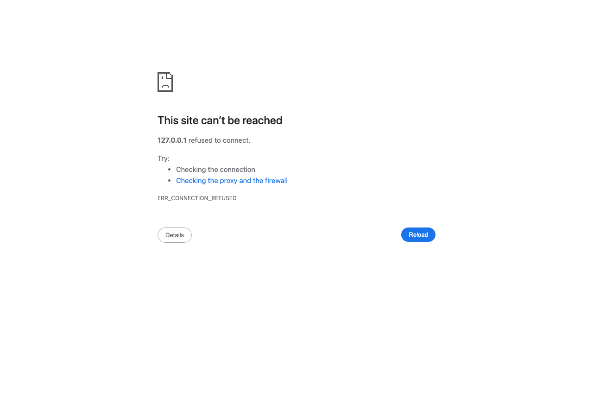
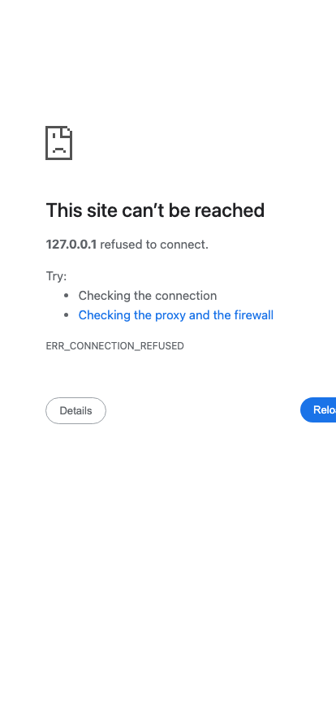

# JouleSerial

> Wireless serial console for ESP32 / ESP8266 over a single bi-directional
> WebSocket. Four log levels with ANSI-coloured badges, history replay on
> reconnect, regex search, hex view, exports, multi-client, command input
> with arrow-key history. MIT-licensed, mobile-ready, **4.6 KB on the wire**.



**Author:** [Chinmoy Bhuyan](mailto:dikibhuyan@gmail.com) · **License:** MIT
· **Targets:** ESP32 (S2 / S3 / C3 / classic), ESP8266

---

## Features

| | |
|---|---|
| ⚡  **WebSocket transport** | Sub-100 ms round-trip; no HTTP polling |
| 🎨 **4 log levels with colour** | DEBUG / INFO / WARN / ERROR each get a distinct tinted badge |
| 🔄 **History replay** | New tab gets the last N lines (default 256) the instant it connects |
| 🔎 **Regex search** | Live filter, in-line `<mark>` highlight on matches |
| 🪪 **Per-line timestamps** | Toggle off / relative-ms / absolute-wall |
| 🧩 **Hex / ASCII view** | One-click toggle for binary debugging |
| ⤓  **Exports** | TXT / JSON / CSV; exports honour current filters |
| ⌨  **Command history** | Up/down arrows recall last 50 commands |
| 👥 **Multi-client sync** | Every tab sees the same stream and shares the command bar |
| 🔤 **Font controls** | 12–16 px live preview; persists in `localStorage` |
| 📊 **Live counters** | Per-level totals + lines/sec rate + connected-client count |
| 🪶 **Light on flash** | Pre-gzipped UI, ~4.6 KB on the wire |
| 📱 **Mobile-first** | Sticky command bar, 44 px touch targets |

---

## Quick start

```cpp
#include <WiFi.h>
#include <ESPAsyncWebServer.h>
#include <JouleSerial.h>

AsyncWebServer server(80);

void setup() {
  WiFi.begin("YOUR_SSID", "YOUR_PASS");
  while (WiFi.status() != WL_CONNECTED) delay(200);

  JouleSerial.begin(&server, "admin", "joule");
  JouleSerial.onMessage([](const String &cmd){
    JouleSerial.inf("got command: %s", cmd.c_str());
    if (cmd == "reboot") ESP.restart();
  });
  server.begin();

  JouleSerial.inf("hello from %s", WiFi.macAddress().c_str());
}

void loop() {
  static uint32_t last = 0;
  if (millis() - last > 2000) {
    last = millis();
    JouleSerial.dbg("heap=%u rssi=%d", ESP.getFreeHeap(), WiFi.RSSI());
  }
}
```

Open `http://<device-ip>/serial` and start typing.

---

## API reference

### Lifecycle

```cpp
void begin(AsyncWebServer *server,
           const String &username = "",
           const String &password = "");
void loop();          // no-op today; reserved for future ping batching
```

### Print-style API (drop-in replacement for `Serial`)

`JouleSerialClass` inherits from `Print`, so anything that takes a `Print&`
or uses `print()`/`println()` works out of the box. Lines are flushed on
`'\n'` and tagged as `INFO`.

```cpp
JouleSerial.println("ready");
JouleSerial.print("temp=");
JouleSerial.println(t, 2);
```

### Levelled API

```cpp
void debug(const String &line);    // DBG badge
void info (const String &line);    // INF badge
void warn (const String &line);    // WRN badge
void error(const String &line);    // ERR badge
```

### `printf`-style helpers

```cpp
void dbg(const char *fmt, ...) __attribute__((format(printf,2,3)));
void inf(const char *fmt, ...) __attribute__((format(printf,2,3)));
void wrn(const char *fmt, ...) __attribute__((format(printf,2,3)));
void err(const char *fmt, ...) __attribute__((format(printf,2,3)));
```

Up to 160 bytes of formatted output is stack-buffered; longer lines fall
back to a heap allocation.

### Inbound commands

```cpp
using SerialMessageCb = std::function<void(const String &command)>;
void onMessage(SerialMessageCb cb);
```

The callback fires once per command-bar Enter press. The `command` string
is exactly what the user typed (no trim, no level prefix).

### Configuration

```cpp
void setHistorySize(size_t n);                   // default 256
void setTitle(const String &t);
void setBrandColor(const String &cssColor);
void setMirrorToHardwareSerial(bool on);         // default true
```

`setMirrorToHardwareSerial(false)` skips the `Serial.print` mirror — useful
for headless devices that have no UART pinout.

---

## HTTP endpoints

| Path | Method | Description |
|---|---|---|
| `/serial`    | GET | The console SPA |
| `/serial/ws` | WS  | Bi-directional log + command stream |

### WebSocket protocol

**Server → client** (one JSON object per frame):

```jsonc
// On connect:
{"type":"hist","lines":[{"seq":1,"ms":836,"lvl":1,"text":"HTTP server started"}, …]}

// Live log line:
{"type":"line","seq":42,"ms":12345,"lvl":2,"text":"low voltage"}

// Client-count change:
{"type":"clients","n":3}
```

`lvl` is `0` (DEBUG) · `1` (INFO) · `2` (WARN) · `3` (ERROR). `ms` is
`millis()` at the time the line was logged.

**Client → server**:

```json
{"type":"cmd","text":"reboot"}
```

---

## UI walkthrough

| Bar | Control | Function |
|---|---|---|
| Header | Title + WS status pill + theme toggle (◐) | Live |
| Top bar | `filter` text input | Regex filter on log body — press `/` from anywhere to focus |
| | Level selector | Min-level filter (DEBUG+ / INFO+ / WARN+ / ERROR) |
| | `▼ Auto` / `⏸ Hold` | Toggle autoscroll; auto-disables when you scroll up |
| | `⏱ rel` / `abs` / `off` | Timestamp display |
| | `𝟬𝟭 text` / `hex` | Toggle hex view |
| | Font selector | 12 / 13 / 14 / 16 px |
| | Export menu | TXT · JSON · CSV (current filter applied) |
| | `✕ Clear` | Wipe local view (server history preserved) |
| | Chips | dbg / inf / wrn / err totals + lines/sec + total + client count |
| Log pane | One row per line: timestamp · level badge · text | Hover to highlight |
| Bottom bar | Command input + `Send ↵` | Up/Down arrows step through last 50 commands |

Mobile (390 px wide):



---

## Patterns

### Routing commands to handlers

```cpp
JouleSerial.onMessage([](const String &cmd){
  if      (cmd == "reboot")      ESP.restart();
  else if (cmd == "heap")        JouleSerial.inf("heap = %u", ESP.getFreeHeap());
  else if (cmd.startsWith("set ")) handleSetCmd(cmd.substring(4));
  else                           JouleSerial.wrn("unknown: %s", cmd.c_str());
});
```

### Replacing `Serial.printf` calls everywhere

```cpp
// before
Serial.printf("got %d packets\n", n);
// after
JouleSerial.inf("got %d packets", n);   // also still goes to Serial
```

### Streaming a CSV log from your code

Just call `JouleSerial.inf()` with comma-separated fields; the UI's CSV
export will re-quote them correctly:

```cpp
JouleSerial.inf("%lu,%d,%.2f", millis(), pktCount, currentA);
```

User clicks **Export → CSV** to download.

### Embedding in your own app

```cpp
AsyncWebServer server(80);
JouleSerial.begin(&server);            // mounts /serial + /serial/ws
server.on("/api/state", HTTP_GET, …);  // your own routes still work
server.begin();
```

### Silent mode (no hardware UART output)

```cpp
JouleSerial.setMirrorToHardwareSerial(false);
```

---

## Performance notes

* Log frames are JSON-encoded inline (no ArduinoJson dependency at run-
  time). String-escape covers `" \ \n \r \t` and control bytes.
* Lines are throttled to a per-event push (no batching) — typical 10–
  100 lines/sec is fine.
* The history ring is FIFO; resize with `setHistorySize(n)`. Each line
  costs roughly `text.length() + 32` bytes.
* The hex-view conversion happens client-side; the server always sends
  the raw text.

---

## Troubleshooting

| Symptom | Cause | Fix |
|---|---|---|
| Console connects then disconnects in a loop | Auth set on the server but credentials wrong | Verify `username` / `password` match what `begin()` saw |
| Lines appear out of order | None — `seq` is monotonic | Sort client-side by `seq` if you care |
| Browser shows "history: 0 lines" after reconnect | Server rebooted between connects | Expected; ring is in RAM |
| `printf` cuts off long lines | >160 byte format result, OOM | Increase the stack buffer or split the log into pieces |

---

## Dependencies

* `ESP32Async/ESPAsyncWebServer @ ^3.7.0`
* `ESP32Async/AsyncTCP @ ^3.4.0`
* arduino-esp32 core 3.x (for `AsyncURIMatcher::exact()`)

`ArduinoJson` is **not** a runtime dependency for this library; it is
listed in `library.json` only because the demo uses it.

---

## License

MIT — see [LICENSE](LICENSE).

---

<sub>**Author:** Chinmoy Bhuyan · **Email:** dikibhuyan@gmail.com · **(c)** 2026 — MIT</sub>
